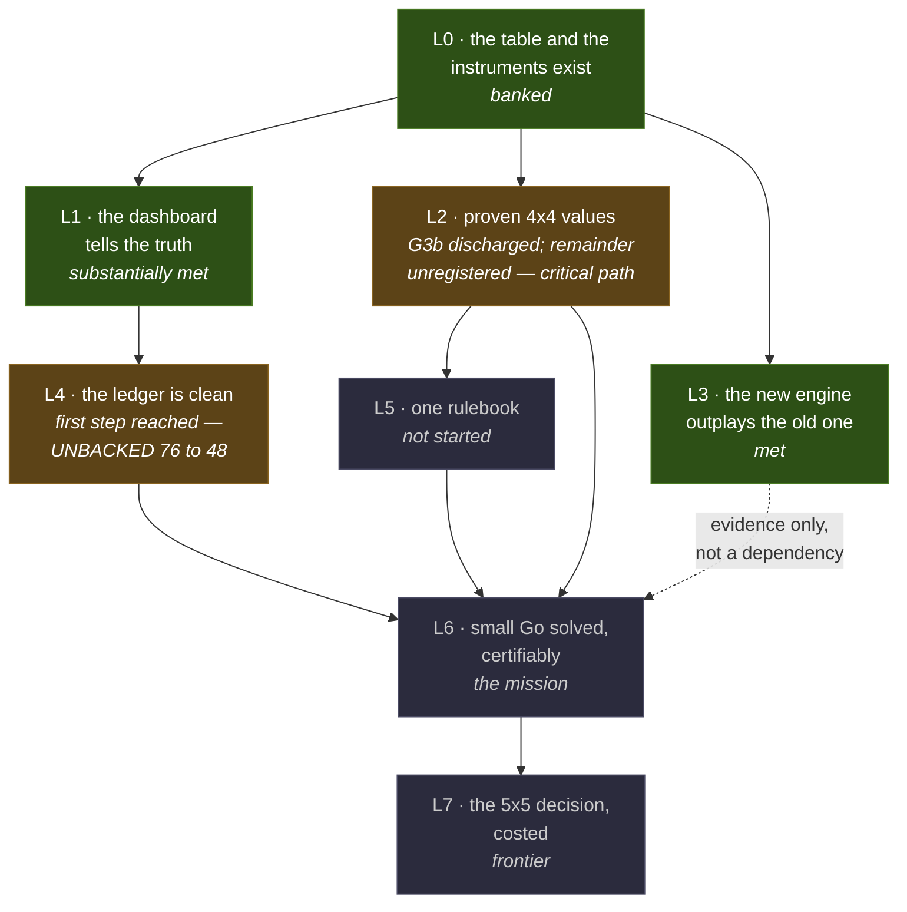

# LANDMARKS — what the human can see, test, and care about

This file is the single home of the landmark definitions L0–L7. Companion to
`docs/audits/2026-08-05-handover/ROADMAP.md`, which orders the work by dependency and speaks the
project's internal language; this file names the checkpoints a human can verify without reading a
single task brief. Each landmark says what changes in plain terms, how to
see it with your own eyes, and where it stands today. Landmarks are observations, not tasks —
nothing here adds work; it only makes the work visible.

**Naming, 2026-08-05 (operator ruling):** these were called *milestones* until this evening.
"Landmark" was chosen because a landmark can be natural or built, large or small, a destination or
just something worth seeing on the way — and because "mile" implies an even spacing this journey
does not have (L3 took an afternoon; L4 is the long middle). The IDs moved `M<n> → L<n>` for a
second, harder reason: `M1`–`M10` are already the **mutant** IDs in
`sprints/verify-battery/pass1/mutants.md`, and `M1` is also the battery harness — the old landmark
IDs collided with both. Documents written before this evening say "milestone M<n>"; as-run records
(findings JSON, sealed race packets, dated status docs) were deliberately **not** rewritten, since
a record of what was run should stay verbatim. Read `milestone M<n>` in those as `landmark L<n>`.

**Every landmark has a short name. Use `L3 (the new engine outplays the old one)`, never a bare
`L3`.** The names are the point of this file: an ID nobody can expand is not communication.

**`L<n>` is reserved, project-globally, for the checkpoints defined in this file** (operator ruling
R4, 2026-08-23). No other axis may mint an L token: the retired fleet-versus-science binary area
tags of the D041 era are not landmarks, and their residue survives only verbatim in as-run
findings. An `L<n>` is a landmark when this file carries it and not before — `L8` and `L9` are
*proposals* in `docs/status/landmark-assignment-2026-08-19.md`.

---

## The map

**How to read it.** `L0` is the ground everything stands on. Three things then run in parallel:
`L1` makes the instruments honest, `L2` makes the values provable, and `L3` checks — independently
of the whole spine — that the rebuild is actually an improvement. `L4` follows `L1`, because
cleaning a ledger with lying gauges just moves the lies. **`L6` is the convergence point**: it needs
`L2` (the values are right), `L4` (the claims are backed) and `L5` (one rulebook) all together —
no two of the three suffice. `L7` is the only thing downstream of the mission.

`L3` connects to `L6` with a dashed line on purpose: it is *evidence* that the reconstruction is
sound, not a prerequisite. If `L3` had failed, we would have stopped and asked why; it passing does
not advance `L6` by itself.

The critical path is therefore **L0 → L2 → L5 → L6**, with `L4` joining at the end — and `L2` is
where the work is.

## The one-paragraph story

We already have a complete 4×4 answer table and a set of instruments that have been shown to catch
deliberately broken input — that is **L0 (the table and the instruments exist)**. What we do *not*
yet have is the right to call those 99 million values *proven*: all four correctness properties
now hold at full scale with denominators (G3b discharged 2026-08-05, twice amended, verdicts
standing), but the move-set check is still a 0.05% sample at 4×4, the KO_SENSITIVE column's own
trust is unruled (Track A), and the #2 auditor gate has not run. Closing that remainder is
**L2 (proven 4×4 values)**, and it is the critical path right now — as of 2026-08-19 it had no
live row on the kanban (see `docs/audits/2026-08-19-L2-audit/VERDICT.md`). Alongside it, the project has been paying down two debts: the dashboard that
describes the project has to stop lying about itself — **L1 (the dashboard tells the truth)** — and
the claim ledger has to stop marking things "proven" with no evidence attached — **L4 (the ledger
is clean)**. Then the fourteen scattered copies of the ko rule collapse into one production
rulebook, **L5 (one rulebook)**, at which point the theorem itself is claimable: **L6 (small Go
solved, certifiably)**. **L7 (the 5×5 decision, costed)** is the prize behind it. Running
independently of that spine, **L3 (the new engine outplays the old one)** is the sanity check that
the reconstruction is actually an improvement — and as of 2026-08-05 it has been measured, on the
board, with the games committed.

| landmark | short name | status today (2026-08-19) |
|---|---|---|
| **L0** | the table and the instruments exist | banked — the suite's known reds now have an owner and a manifest gate (`docs/infra/suite-truth.md`, T369) |
| **L1** | the dashboard tells the truth | substantially met; observation layer rebuilt (T439/T441/T446/T464); open seams: suite reading is caller-dependent (T454), deployed managent binary stale pending fleet drain |
| **L2** | proven 4×4 values | **G3b discharged 2026-08-05 (amended ×2, verdicts stand); L2 itself NOT discharged — remainder (I11 exhaustive, Track A ruling, #2 auditor, denominator absorption) was unregistered until 2026-08-19** |
| **L3** | the new engine outplays the old one | **met 2026-08-05**, scope stated; unchanged |
| **L4** | the ledger is clean | first declared step reached — UNBACKED 76 → 48 (claimlint C3=48, 2026-08-19); register parses 228 rows |
| **L5** | one rulebook | not started; correctly waits on L2 and the mutation-adequacy promotion gate |
| **L6** | small Go solved, certifiably | the mission; needs L2 + L4 + L5 |
| **L7** | the 5×5 decision, costed | frontier; only after L6 |

---

## L0 — the table and the instruments exist *(banked, with one caveat you should know about)*

A complete 4×4 table exists — 99,133,036 entries, every reachable position present, none extra —
and the instruments that judge it have been proven to work: every check first had to catch a
deliberately sabotaged input before its "pass" counted for anything.

**See it yourself:** play the engine over GTP (Go Text Protocol) in Sabaki or GoGui — it plays
real, legal, strong small-board Go right now. The battery's own self-test:
`verify-battery 3x3 artifacts/oracle-3x3.wzo` reproduces the recorded golden-master numbers.

**Status caveat, 2026-08-05:** this landmark's original self-test was "`zig build test` runs the
battery green", and **that command is red today** — broken by construction since row T346, where a
test target was wired so that it cannot compile. The instruments themselves are fine (they were
re-verified in isolation on 2026-08-05: the clean 3×3 artifact reproduced the golden master
exactly, and a single deliberately altered *value* was caught by two independent invariants). But
by this file's own rule — the test outranks the narrative — L0 is not currently *observable*.
Restoring it is row T369; the specific wiring fix belongs to T363, whose gate it is.

**Status, 2026-08-19 (T467 audit):** T369 closed (pass-with-findings). `zig build test` is still
red, but the redness is now *governed*: `docs/infra/suite-truth.md` is the manifest of known
reds (7 deterministic crashes across three root causes + failing shell regressions, measured
baseline run 2, 2026-08-18, 810.9 s), and `tools/suite-truth.sh` exits 0 only when observed ==
manifest, ratchet-down only. Caveat carried forward: the suite's reading depends on who runs it
(`MANAGENT_TASK_ID` leak, row T454 — open), so the gate's first independent run went red and was
right to.

## L1 — the dashboard tells the truth *(roadmap Tier 0 — substantially delivered)*

What the project says about itself matches reality: no stale binaries, no gauge reading that
disagrees with a fresh measurement, no messages rotting unread in the queue.

**See it yourself:** run `bin/managent resume`. It should show zero STALE lines and no stalled
directives, and the gate numbers it prints should match a fresh run of `bin/weizigo-claimlint`.

**Status, 2026-08-05:** delivered during the day — binaries rebuilt and current, the 24-message
backlog drained, the unabsorbed-findings gauge taken from 4 to 0, and **two defects found in the
smoke test itself**, one of which had been passing vacuously since the line was written (it
filtered for tests by a pattern that matched *zero* tests, and zero tests passing exits
successfully). One gauge still mis-reads: a rename in one tool orphaned the trigger text another
tool watches for, so an auto-absorb trigger silently reads zero forever (row T368). Also newly
found: the liveness display cannot distinguish a working agent from a dead one, because the
identity that would tell them apart is never passed in (row T370).

**Status, 2026-08-19 (T467 audit):** the observation layer was rebuilt across 2026-08-12..19 —
the directive channel that delivered to nobody was found and fixed (T439), five
observation-layer fixes verified (T441), closed assertions render from the ledger so done rows
are never re-dispatched (T446, commit 142ad0c), and one status resolver is shared by
status/next/liveness/audit (T464, commit d1ca608). Liveness itself was settled by operator
ruling: status is an *assertion* with an author and timestamp, absence is UNKNOWN. Open seams:
the suite reading is caller-dependent (T454), and the deployed `bin/managent` is stale relative
to d1ca608 pending fleet drain — the resume surface currently says so itself, which is the gauge
working. Fourteen days of L1-stale status in this very file (L2 "in flight" after the row
closed) is the L1 failure the 2026-08-19 audit corrects.

## L2 — proven 4×4 values, an answer key rather than an opinion *(roadmap Tier 1 — the critical path)*

Today's honest sentence, which must not be shortened: *the 4×4 artifact is structurally complete;
its values are verified for Bellman residual and key agreement at full scale, and not yet for
closure or cycle containment.* After L2, all four properties hold — every value verified to be
*the* answer under the written rules, with the full table as the denominator, never a sample. This
is the difference between "a strong engine's opinion" and "an answer key".

**See it yourself:** the discharge ruling will state each property as `0 violations / <full
count>` — **if any line lacks a denominator, the landmark is not met, whatever the prose says.**
That rule exists because it was broken once: two properties were tabled as "pass" on a 22-entry
sample — 0.00002% of the table — and had to be corrected to "deferred".

For a hands-on test: corrupt a *copy* of an artifact and run the battery against it — it must fail
loudly. **Do it the strong way.** A blind byte flip is caught by the file's internal checksum, so
it only proves the checksum works; the corruption never reaches a single correctness check. The
real test changes a *value* and repairs the checksum, so the lie reaches the invariants. That was
run on 2026-08-05 (`docs/evidence/BATTERY/seeded-control-2026-08-05.md`): one value altered out of
12,675 legal cells, and two independent checks fired — the Bellman residual check went from 0 to 4
violations — while six unrelated checks stayed exactly still. A green light you have watched turn
red when it should is the only green light worth trusting.

**Status, 2026-08-19 (T467 audit; supersedes the paragraph this replaced, which described
2026-08-05 morning):** all four properties are established at full scale with denominators, and
G3b was discharged the evening of 2026-08-05 (accept.md signed ruling + two amendments; verdicts
stand). The corrected readings, per `docs/audits/2026-08-19-L2-audit/VERDICT.md` §1: Bellman
**0 / 95,677,624** clear + **0 / 3,455,412** set (second engine route: **0 / 99,133,036**,
A2_exhaustive); key agreement **0 / 99,133,036** (4×4) and **0 / 643,378** (4×3); closure C-A1
**0 / 616,030,190** and C-A2 **0 / 99,133,034** (corrected ko decode, T383 — the
600,763,414 / 99,020,312 figures still quoted in `instrument-coverage.md` and `CLAIMS.md` are
the wrong-decode denominators); cycle containment **0 / 3,455,412** (4×4) and **0 / 170,181**
(4×3). **L2 itself is NOT met:** I11 is a 0.05% sample at 4×4 (0 / 50,000 of 99,133,036 — this
landmark says "never a sample"), the KO_SENSITIVE column remains distrusted pending a Track A
ruling (T380 F-8 is evidence it may be dischargeable by ruling), the #2 auditor gate has not
run, and the mutation kill matrix contradicts the discharge record (mutants.md vs T363). Until
2026-08-19 none of that remainder was a registered row.

## L3 — the new engine outplays the old one, watchably *(met 2026-08-05)*

The ratified bar for the whole reconstruction is "at least as good as today's 4×4 engine." This
landmark makes that bar watchable: the two engines play each other, both colour assignments, and
every game where the old engine genuinely threw away a winnable position is recorded as an SGF
(Smart Game Format) file you can step through move by move.

**See it yourself:** open the SGF files in `docs/evidence/ENGINE-VS-ENGINE/` in any Go viewer. No
committed kifu (game record), no landmark.

**Status: met.** 132 games committed (33 openings × 2 colour assignments × 2 rule frames, seed 42),
all 132 structurally valid and annotated at the divergence move. The direction of the result is
**the new engine is better**: the old engine lost 36–30 in the shared-rules frame, and in **9
games it threw away a position it could have won or drawn** — the new engine, given the same
colour from the same opening, does win them. The cleanest single case: at one position *both*
tables agree White is winning by 16, and the old engine then loses by 3 from it, while the new
engine wins by 16 — a 19-point swing that shows the old table contradicting its own play.

**The scoring bar, stated correctly (operator, 2026-08-05).** "Wins more than half" is only
meaningful when each engine plays *both* colours over the same position set — which this test does,
33 openings × 2 colour assignments. Under that symmetry the bar is: the new engine **must win half
or more**, and — the sharper test — **from the same position, as the same colour, against the same
opponent, it must do no worse than the old engine.** The raw head-to-head scoreline is not the
measure: many forced openings are simply lost for whichever engine draws that colour, which is what
"not attributable" counts (33 of 36). The signal is the asymmetry in *thrown-away* games: old 3 and
7, new 0 and 0.

**Scope, stated plainly:** the two artifacts encode slightly different rulesets, so a raw
value-by-value comparison would be comparing two different games. Only an *outcome* difference was
counted as a loss, and 62 of 66 comparisons fall in the directly-comparable slice. A second run
with a different random seed reproduced the shape.

## L4 — the ledger is clean *(roadmap Tier 2 — opened 2026-08-05)*

Every claim marked PROVEN links to committed evidence you can open; every claim that cannot be
backed has been demoted or archived with a one-line epitaph saying why. The number nobody watched,
because it never failed anything: **76 of 100 PROVEN rows have no committed evidence.**

**See it yourself:** `bin/weizigo-claimlint` reports `UNBACKED 0`. Then the spot-check: pick any
PROVEN row at random, follow its evidence path, and confirm the file exists and says what the row
says. If a random probe ever fails, the landmark is off.

**Status:** the plan now exists and has been ruled on. All 334 ledger rows were classified with
denominators (row T354): 201 are live claims, 132 are history — measurements of artifacts the
project has since disowned, ruleset experiments that were foreclosed, player-side diagnostics, and
process notes — and those 132 move to an archive **in full, with epitaphs, never deleted**. The
live ledger goes 334 → 202. The unbacked count comes down in four declared steps (76 → 48 → 32 →
18 → 0), each step's floor locked in only by the commit that reaches it, so the number can never
quietly climb again. Row T373 executes the first step and is deliberately blocked until T363
finishes, because it touches machinery that could otherwise freeze every agent's ability to commit.

**Status, 2026-08-19 (T467 audit):** the first declared step is reached — `bin/weizigo-claimlint`
today reads **C3 UNBACKED = 48** (the 76 → 48 floor, hook-gated in `claimlint-floor.json`), with
the register parsing 228 rows, C1a/C1b/C6/C9 = 0, C2 dangling = 11, C7 unabsorbed = 6 (above the
threshold of 5 — live churn from today's closes, STANDING-ABSORB's job), and calibration PASS.
Remaining to the landmark: 48 → 32 → 18 → 0, plus the proposed STANDING-CLAIMVERIFY background
row (one prose-only PROVEN claim re-probed per pass, `docs/status/backlog-2026-08-19.md`).

## L5 — one rulebook *(roadmap Tier 3)*

The rules of Go, as this project defines them, live in exactly one production module. The fourteen
historical copies of the ko rule — the confirmed root cause of the project's worst bugs — become
frozen museum pieces that the tests compare against but nothing runs in anger.

**See it yourself:** ask "where is the ko rule?" and get one file as the answer. The engine you
play in L0's test is, from here on, playing through that one rulebook.

**Status:** not started, correctly. The kernel extraction it depends on has landed but is held
unpromoted on purpose — promotion is gated on mutation testing showing the tests can actually
catch a broken rule.

## L6 — the theorem: small Go solved, certifiably *(the mission)*

For every legal position on every board up to 4×4, the exact game-theoretic value is known, proven
under the written axioms, with explicit non-claims for everything outside them. weizigo stops being
a strong program and becomes a reference — the answer key other Go software could be checked
against.

**See it yourself:** play any 4×4 position against the oracle from both sides, any line you like —
the result it predicted is the result you get, every time. The certification machinery
(L2 + L4 + L5) is what turns that experience from anecdote into theorem.

## L7 — the 5×5 decision, with a price tag *(frontier; only after L6)*

A one-page go/no-go memo for 5×4 and 5×5: measured cost per board size, the measured 16× symmetry
saving, projected memory and wall-clock on this host. Whatever the decision, it will be a costed
choice, not a hope.

**See it yourself:** the memo fits on one page and every number in it cites the run that measured
it.

---

## How work reports against landmarks

Findings files and commit messages are written for the next agent; this section exists so the human
gets a sentence written for them. **After a row records its findings to disk, its close report adds
a short landmark line** — no new artifact, no schema change, no extra approval step:

> **Landmark:** advances `M<n> (<short name>)` — <what a human can now see that they could not
> before> — <what still stands between here and that landmark>.

Three rules make it useful rather than decorative (full discipline in `AGENTS.md` §Landmarks):

1. **Always expand the ID.** `L2 (proven 4×4 values)`, never a bare `L2`.
2. **Say the direction plainly.** If a result makes something look *worse*, say which thing got
   worse and which got better. "Every game diverged and there were 9 genuine losses" is
   uninterpretable until you say **whose** losses they were and that the new engine wins them.
3. **A row that advances no landmark says so** — `Landmark: none directly; unblocks <row>`. Fleet
   plumbing and hygiene rows are honest work; pretending they move the mission is what makes
   landmark talk worthless.

**Reading progress:** L1 is observable this week; L2 is the current critical path; L3 is done;
L4 is the long middle now opened; L5 follows L2; L6 is the mission; L7 is the prize behind it. When
any landmark's self-test fails, the landmark is not met — the tests above outrank any narrative,
including this one.
